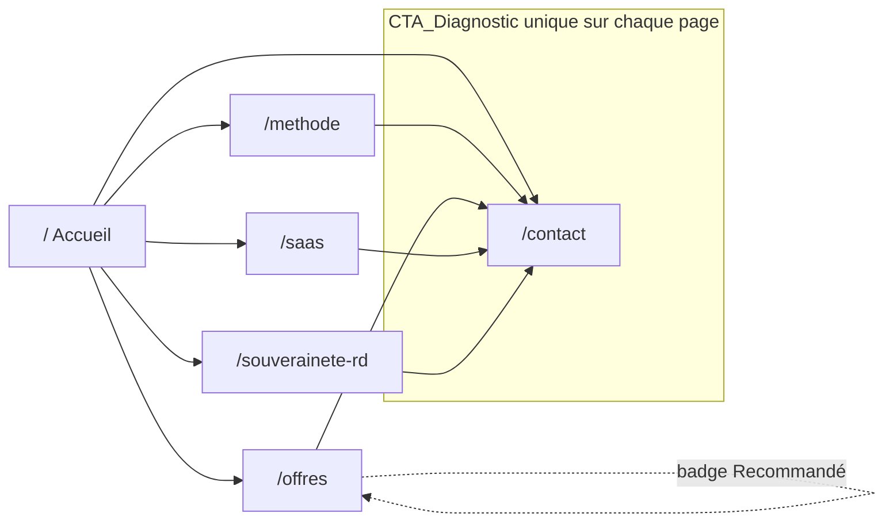

# Design Document

## Overview

Ce document décrit la conception technique de la refonte du site vitrine public d'Opays Tech. Il traduit les 13 exigences du document de requirements en décisions d'architecture, en interfaces de composants et en propriétés de correction vérifiables.

La refonte transforme le one-pager actuel (une seule route `index.tsx` agrégeant les sections Hero, Approche, Solutions, RD, Vision, PourquoiNous, FAQ, Contact, Footer) en un site multi-pages de six pages publiques distinctes : Page_Accueil, Page_Methode, Page_Offres, Page_SaaS, Page_Souverainete_RD et Page_Contact. Elle conserve l'identité visuelle existante (effets glass, néon, animations framer-motion) et reste strictement cohérente avec le spec `site-hardening-amelioration` (SEO par page, conformité légale, confidentialité des prototypes).

Le parti pris d'ingénierie reste celui d'Opays Tech, cabinet d'« ingénierie de l'efficience » : on part du terrain (besoin du Public_Cible), puis de la méthode (offres, preuves, livrables), puis de l'implémentation. On privilégie des changements petits, lisibles et réversibles, on réutilise l'outillage déjà présent (TanStack Router, React 19, Tailwind 4, Vite 7, Cloudflare, Zod) plutôt que d'introduire de nouvelles dépendances, et chaque décision sert d'abord la vente, la confiance et la maintenabilité.

### Principe de conception central : séparer le contenu de son rendu

La difficulté de cette refonte n'est pas le rendu visuel (déjà maîtrisé) mais la **garantie de cohérence et de validité du contenu** exigée par les requirements : un Resume_Offre doit comporter exactement cinq lignes non vides d'au plus 280 caractères (Exigence 4), une Phase_Methode incomplète doit être omise (Exigence 5.6), une métrique sans source doit être masquée (Exigence 6.5), un CTA_Diagnostic doit être strictement identique sur toutes les pages (Exigence 10.1), etc.

La conception isole donc le **contenu structuré** (données typées : paliers, phases, métriques, produits, équipe) et un **noyau de logique pure** qui valide, filtre et prépare ce contenu avant rendu. Les composants React deviennent de fins consommateurs de données déjà validées. Ce découpage rend l'essentiel des règles testable par propriétés, sans dépendance au DOM ni au réseau.

### Contexte technique constaté

L'analyse du code existant établit les faits suivants, qui orientent la conception :

- Le site est une SPA TanStack Router (`src/router.tsx`, routes dans `src/routes/`, arbre généré `src/routeTree.gen.ts`), bâtie avec React 19, Tailwind 4 et Vite 7. Le routage est basé fichiers : chaque fichier de `src/routes/` devient une route.
- La route `index.tsx` agrège aujourd'hui toutes les sections en un one-pager ; la navigation interne se fait par ancres (`#approche`, `#solutions`…). La refonte remplace ces ancres par de vraies routes.
- `@tanstack/react-start` est déjà présent dans les dépendances, ce qui ouvre la voie au pré-rendu/SSR sans nouvelle dépendance majeure (mutualisé avec le spec `site-hardening-amelioration`).
- Le déploiement cible Cloudflare (`@cloudflare/vite-plugin`). L'identité visuelle repose sur des classes utilitaires (`glass`, `text-gradient`, `grid-bg`, variables `--neon-cyan`, `--shadow-neon`, `--gradient-hero`) et sur `framer-motion`.
- La `Navbar` actuelle expose un lien « Tenant 0 » (prototype) et un bouton « Consultance gratuite » ; le `Footer` affiche une année figée et un lien `Privacy` mort. Ces points sont traités par le spec de durcissement et doivent rester cohérents avec la refonte.
- Les routes prototypes `tenant-0` et `bridges-os` existent et doivent rester hors navigation publique, hors sitemap et non indexables (cohérence avec Exigence 12).

### Objectifs de conception

| Objectif | Exigences couvertes |
|----------|---------------------|
| Six pages publiques distinctes, navigables côté client | 1 |
| Public cible unique et message-pivot exact, immédiatement visibles | 2 |
| Offres productisées sans montant, palier recommandé et porte d'entrée signalés | 3 |
| Resume_Offre conforme aux cinq lignes obligatoires d'OPAYS_HQ §9 | 4 |
| Méthode en phases avec livrables nommés et durées | 5 |
| Bloc de preuves crédible, borné, anonyme, sourcé | 6 |
| Équipe fondatrice nommée avec rôles | 7 |
| Page des produits SaaS valide et actionnable | 8 |
| Page souveraineté / R&D portant l'angle différenciant | 9 |
| CTA_Diagnostic unique, identique et répété | 10 |
| Continuité de l'identité visuelle, lisibilité prioritaire | 11 |
| Compatibilité SEO / légal / confidentialité avec le durcissement | 12 |
| Liens vers chantiers externes préparés sans refonte structurelle | 13 |

## Architecture

### Vue d'ensemble

```mermaid
flowchart TD
    subgraph Source["Contenu structuré (source unique typée)"]
        OFFERS[offers.ts\nPaliers + Resume_Offre]
        METHOD[method.ts\nPhases + Livrables]
        PROOF[proof.ts\nMétriques + sources]
        SAAS[saas.ts\nProduits SaaS]
        TEAM[team.ts\nFondateurs]
        NAV[navigation.ts\nPages publiques + CTA]
    end

    subgraph Core["Noyau de logique pure (testable)"]
        VO[validateResumeOffre]
        VM[selectRenderablePhases]
        VP[selectRenderableMetrics]
        VS[selectRenderableProducts]
        VT[selectRenderableMembers]
        CTA[resolveCta]
        META[buildPageMeta / sitemap\n(réutilisé du durcissement)]
        EXT[resolveExternalLink]
    end

    subgraph Render["Couche de rendu (React + TanStack)"]
        ROUTES[Routes /, /methode, /offres,\n/saas, /souverainete-rd, /contact]
        NAVBAR[Navigation_Principale]
        SHELL[PublicLayout\nNavbar + Outlet + Footer]
        UI[Composants de page\n(glass / néon / framer-motion)]
    end

    OFFERS --> VO --> UI
    METHOD --> VM --> UI
    PROOF --> VP --> UI
    SAAS --> VS --> UI
    TEAM --> VT --> UI
    NAV --> CTA --> NAVBAR
    NAV --> META --> ROUTES
    NAV --> EXT --> NAVBAR
    ROUTES --> SHELL --> UI
    SHELL --> NAVBAR
```

### Décisions d'architecture et justifications

**A1. Routage multi-pages fichier par fichier (Exigence 1).**
Chaque page publique devient une route TanStack dédiée dans `src/routes/` : `index.tsx` (Accueil), `methode.tsx`, `offres.tsx`, `saas.tsx`, `souverainete-rd.tsx`, `contact.tsx`. Le routage basé fichiers fournit nativement une URL dédiée et unique par page (1.1, 1.4), la navigation client sans rechargement via `<Link>` (1.7), et la `notFoundComponent` déjà définie dans `__root.tsx` couvre l'URL inconnue avec retour à l'accueil (1.5). Aucune nouvelle dépendance.

**A2. Layout public partagé (Exigences 1, 10, 11, 12).**
Un composant `PublicLayout` (Navbar + `<Outlet/>` + Footer) est monté via une route de layout (`routes/_public.tsx` ou réutilisation de `__root`). Il garantit que la Navigation_Principale, le pied de page légal et au moins une occurrence du CTA_Diagnostic apparaissent sur **toutes** les pages publiques de façon homogène, sans duplication. La Navbar lit la source unique `navigation.ts` pour ses liens et l'état actif (1.2, 1.6).

**A3. Contenu structuré comme source unique typée (Exigences 3 à 9).**
Tout le contenu marketing à fortes contraintes (paliers, résumés d'offre, phases, métriques, produits, équipe) vit dans des modules de données typés sous `src/content/`. C'est la **source de vérité**. Les composants n'inventent jamais de contenu : ils consomment la sortie validée du noyau. Cela centralise les règles d'OPAYS_HQ §9 et des exigences, et évite la dérive entre pages.

**A4. Noyau de logique pure de validation/sélection (Exigences 4, 5, 6, 7, 8).**
Un ensemble de fonctions pures (`src/content/rules/`) applique les règles « afficher / omettre » :
- `validateResumeOffre` : vérifie les cinq lignes obligatoires, non vides, ≤ 280 caractères, et leur ordre.
- `selectRenderableOffers`, `selectRenderablePhases`, `selectRenderableMetrics`, `selectRenderableProducts`, `selectRenderableMembers` : filtrent les entrées incomplètes ou hors bornes plutôt que d'afficher un champ vide (4.7, 5.6, 6.5, 7.6, 8.5/8.6).
Ces fonctions sont pures, sans I/O, donc testables par propriétés sur un large espace d'entrées.

**A5. CTA_Diagnostic résolu depuis une constante unique (Exigence 10).**
Le libellé et la cible du CTA sont définis **une seule fois** dans `navigation.ts` (`CTA_DIAGNOSTIC`). Toute occurrence du CTA dans le site lit cette constante via `resolveCta()`. Cela garantit mécaniquement l'unicité du libellé et l'identité stricte (texte et casse) sur toutes les pages (10.1), et l'unicité de l'action principale par page (10.5). La cible est la Page_Contact (`/contact`).

**A6. Métadonnées et indexation réutilisées du durcissement (Exigence 12).**
La refonte réutilise les générateurs purs `buildPageMeta` (`src/lib/seo/meta.ts`) et `buildRobotsTxt` / `buildSitemapXml` (`src/lib/seo/sitemap.ts`) introduits par le spec `site-hardening-amelioration`. L'ajout d'une page publique se fait en ajoutant une entrée à la source unique `PUBLIC_ROUTES`, ce qui propage automatiquement titre/description/canonical et l'inclusion au sitemap (12.1, 12.2, 12.4, 12.8). Les prototypes restent exclus (12.5, 12.6).

**A7. Liens externes préparés mais inactifs par défaut (Exigence 13).**
Un registre `externalProjects.ts` liste les Chantier_Externe avec leur URL (optionnelle). `resolveExternalLink()` ne rend un lien que si l'URL est renseignée et valide ; sinon, aucun lien n'est affiché (13.4). Les liens externes ouvrent un nouvel onglet avec signalement visuel (icône + `aria-label`) et `rel="noopener noreferrer"` (13.3). Le registre est conçu pour accueillir une nouvelle entrée **sans modifier** la Navigation_Principale (13.2), et ses URLs sont exclues du sitemap et des canoniques (13.5).

### Plan de navigation



### Cartographie pages ↔ exigences

| Page (URL) | Rôle | Exigences principales |
|------------|------|------------------------|
| `/` Accueil | Message-pivot, public cible, portes d'entrée, preuves, équipe | 2, 6, 7, 10, 11, 12 |
| `/methode` | Phases, livrables, durées | 5, 10, 11, 12 |
| `/offres` | Trois paliers, résumés d'offre, sans montant | 3, 4, 10, 11, 12 |
| `/saas` | Produits SaaS | 8, 10, 11, 12 |
| `/souverainete-rd` | Souveraineté, IA locale, RBAC, patrimoine cognitif, R&D | 9, 10, 11, 12 |
| `/contact` | Demande de Diagnostic gratuit | 10, 11, 12 |

## Components and Interfaces

### 1. Modèles de contenu (`src/content/`)

Modules de données typés, source unique de vérité. Aucun comportement, uniquement des constantes typées validées au build par les fonctions du noyau.

```typescript
// src/content/offers.ts
type OfferTier = "diagnostic" | "systeme" | "transformation";

interface ResumeOffre {
  problemeTraite: string;       // ligne 1
  solutionProposee: string;     // ligne 2
  beneficeOperationnel: string; // ligne 3
  niveauAccompagnement: string; // ligne 4
  prochaineAction: string;      // ligne 5
}

interface Offer {
  tier: OfferTier;
  order: number;            // ordre croissant d'engagement
  title: string;            // ex. « Diagnostic d'Efficience »
  branch?: "FORGE" | "SOVEREIGN";
  recommended: boolean;     // vrai uniquement pour Palier_Systeme
  isEntryPoint: boolean;    // vrai uniquement pour Palier_Diagnostic
  deliverables: string[];   // livrables affichés
  resume: ResumeOffre;
}

const OFFERS: Offer[]; // exactement les 3 paliers, dans l'ordre
```

```typescript
// src/content/method.ts
type TimeUnit = "jours" | "semaines";

interface MethodPhase {
  id: string;
  order: number;
  name: string;
  deliverables: string[];        // au moins un libellé non vide
  duration: { value: number; unit: TimeUnit } | null;
  category: "terrain" | "frictions" | "construction" | "mise-en-service";
}

const METHOD_PHASES: MethodPhase[]; // >= 4 phases couvrant les 4 catégories
```

```typescript
// src/content/proof.ts
type MetricCategory = "temps-gagne" | "erreurs-evitees" | "roi";

interface ProofMetric {
  category: MetricCategory;
  value: number;
  unit: string;                 // unité de mesure (%, h, x…)
  label: string;                // formulation générique, sans nom de client
  source: string | null;        // source de validation interne consultable
}

const PROOF_METRICS: ProofMetric[];
```

```typescript
// src/content/saas.ts
interface SaasProduct {
  name: string;                 // 1..60 caractères
  description: string;          // 40..300 caractères, valeur opérationnelle
  accessUrl: string | null;     // lien d'accès au produit (optionnel)
}

const SAAS_PRODUCTS: SaasProduct[]; // 2..12 produits ; inclut Opays Nexus + Brand Content OS
```

```typescript
// src/content/team.ts
interface TeamMember {
  fullName: string;
  roles: string[];              // au moins un rôle
}

const FOUNDERS: TeamMember[]; // 4 fondateurs nommés
```

```typescript
// src/content/navigation.ts
interface NavPage {
  path: string;       // URL dédiée
  label: string;      // libellé de navigation
}

const PUBLIC_PAGES: NavPage[]; // 6 pages publiques

const CTA_DIAGNOSTIC: {
  label: "Diagnostic gratuit";   // choisi une seule fois
  target: "/contact";
};
```

```typescript
// src/content/externalProjects.ts
interface ExternalProject {
  id: "audit-ia" | "opays-commons";
  label: string;
  url: string | null; // null tant que le chantier n'est pas mis à disposition
}

const EXTERNAL_PROJECTS: ExternalProject[];
```

### 2. Noyau de règles (`src/content/rules/`)

Logique pure, sans I/O. Source de vérité des Exigences 4 à 8.

```typescript
// resume.ts
const RESUME_LINE_MAX = 280;
const RESUME_LINE_ORDER = [
  "problemeTraite", "solutionProposee", "beneficeOperationnel",
  "niveauAccompagnement", "prochaineAction",
] as const;

type ResumeValidation =
  | { ok: true }
  | { ok: false; reason: "empty-line" | "too-long"; line: string };

// Vrai ssi les 5 lignes sont présentes, non vides (après trim), <= 280 caractères.
function validateResumeOffre(resume: ResumeOffre): ResumeValidation;

// Renvoie les 5 lignes dans l'ordre obligatoire (Exigence 4.6).
function orderedResumeLines(resume: ResumeOffre): { key: string; text: string }[];
```

```typescript
// offers.ts
// Filtre les paliers dont le Resume_Offre est incomplet (Exigence 4.7),
// trie par ordre croissant d'engagement (Exigence 3.1).
function selectRenderableOffers(offers: Offer[]): {
  renderable: Offer[];
  omitted: { tier: OfferTier; reason: ResumeValidation }[];
};
```

```typescript
// method.ts
// Ne conserve que les phases ayant >= 1 livrable non vide ET une durée,
// triées par ordre chronologique (Exigences 5.2, 5.3, 5.5, 5.6).
function selectRenderablePhases(phases: MethodPhase[]): MethodPhase[];

// Vrai ssi les 4 catégories obligatoires sont couvertes (Exigence 5.4).
function coversRequiredCategories(phases: MethodPhase[]): boolean;
```

```typescript
// proof.ts
// Bornes de plausibilité par catégorie (Exigence 6.4).
const METRIC_BOUNDS: Record<MetricCategory, { min: number; max: number }>;

// Conserve les métriques sourcées ET dans les bornes ; masque les autres (6.4, 6.5).
// Le résultat est plafonné à 6 et requiert >= 3 métriques couvrant les 3 catégories (6.1, 6.2).
function selectRenderableMetrics(metrics: ProofMetric[]): ProofMetric[];
```

```typescript
// saas.ts
const NAME_MIN = 1, NAME_MAX = 60, DESC_MIN = 40, DESC_MAX = 300;
const PRODUCTS_MIN = 2, PRODUCTS_MAX = 12;

// Conserve les produits valides (longueurs respectées), plafonne à 12 (Exigences 8.1, 8.2).
function selectRenderableProducts(products: SaasProduct[]): SaasProduct[];

// Détermine l'action d'un produit : lien d'accès si URL valide, sinon CTA_Diagnostic (8.4, 8.6).
function resolveProductAction(product: SaasProduct):
  | { kind: "access"; url: string }
  | { kind: "cta" };
```

```typescript
// team.ts
// Omet toute fiche sans nom OU sans rôle (Exigence 7.6).
function selectRenderableMembers(members: TeamMember[]): TeamMember[];
```

```typescript
// cta.ts
// Renvoie toujours le CTA unique (libellé + cible) défini une seule fois (Exigence 10.1).
function resolveCta(): { label: string; target: string };
```

```typescript
// externalLinks.ts
// Ne renvoie un lien que si l'URL est renseignée et absolue valide (Exigence 13.4).
function resolveExternalLink(project: ExternalProject):
  | { visible: true; url: string; label: string; external: true }
  | { visible: false };
```

### 3. Couche de rendu (`src/routes/` et `src/components/`)

| Élément | Rôle | Exigences |
|---------|------|-----------|
| `routes/_public.tsx` (layout) | Monte `PublicLayout` (Navbar + Outlet + Footer) pour toutes les pages publiques | 1, 10.2, 12.7 |
| `routes/index.tsx` | Page_Accueil : message-pivot, public cible, axes différenciants, Bloc_Preuves, Section_Equipe, portes d'entrée | 2, 6, 7, 10, 11 |
| `routes/methode.tsx` | Page_Methode : phases (`selectRenderablePhases`) | 5, 10, 11 |
| `routes/offres.tsx` | Page_Offres : paliers (`selectRenderableOffers`), résumés ordonnés, badges | 3, 4, 10, 11 |
| `routes/saas.tsx` | Page_SaaS : produits (`selectRenderableProducts`, `resolveProductAction`) | 8, 10, 11 |
| `routes/souverainete-rd.tsx` | Page_Souverainete_RD : IA locale, RBAC, patrimoine cognitif, R&D | 9, 10, 11 |
| `routes/contact.tsx` | Page_Contact : formulaire de Diagnostic (réutilise `Contact.tsx` durci) | 10, 11, 12 |
| `components/Navbar.tsx` | Navigation_Principale : liens depuis `PUBLIC_PAGES`, état actif, CTA, liens externes conditionnels | 1.2, 1.6, 10, 13 |
| `components/Footer.tsx` | Pied de page : liens légaux (mentions légales, confidentialité) | 12.7 |
| `components/CtaDiagnostic.tsx` | Bouton CTA unique lisant `resolveCta()` | 10.1, 10.2, 10.5 |
| `components/ProofBlock.tsx` | Bloc_Preuves (consomme `selectRenderableMetrics`) | 6 |
| `components/TeamSection.tsx` | Section_Equipe (consomme `selectRenderableMembers`) | 7 |
| `components/ExternalLink.tsx` | Lien externe signalé, nouvel onglet | 13.3 |

Chaque route déclare ses métadonnées via l'API `head()` de TanStack Router alimentée par `buildPageMeta` (réutilisé du durcissement), garantissant `<title>`, `description` et `<link rel="canonical">` conformes (Exigence 12).

### 4. Navigation et état actif

La Navbar reçoit la liste `PUBLIC_PAGES` et utilise `useRouterState`/`useMatchRoute` de TanStack Router pour marquer le lien courant d'un état visuel actif distinct (Exigence 1.6). La transition entre pages utilise `<Link>` (navigation client sans rechargement, Exigence 1.7).

## Data Models

### Offre et résumé d'offre

```typescript
interface ResumeOffre {
  problemeTraite: string;       // non vide, <= 280
  solutionProposee: string;     // non vide, <= 280
  beneficeOperationnel: string; // non vide, <= 280
  niveauAccompagnement: string; // non vide, <= 280
  prochaineAction: string;      // non vide, <= 280
}

interface Offer {
  tier: "diagnostic" | "systeme" | "transformation";
  order: number;            // 1, 2, 3 (ordre croissant d'engagement)
  title: string;
  branch?: "FORGE" | "SOVEREIGN";
  recommended: boolean;     // true uniquement pour "systeme"
  isEntryPoint: boolean;    // true uniquement pour "diagnostic"
  deliverables: string[];
  resume: ResumeOffre;
}
```

### Phase de méthode

```typescript
interface MethodPhase {
  id: string;
  order: number;
  name: string;
  deliverables: string[];                          // >= 1 libellé non vide pour être rendue
  duration: { value: number; unit: "jours" | "semaines" } | null; // requis pour être rendue
  category: "terrain" | "frictions" | "construction" | "mise-en-service";
}
```

### Métrique de preuve

```typescript
interface ProofMetric {
  category: "temps-gagne" | "erreurs-evitees" | "roi";
  value: number;          // doit rester dans les bornes de plausibilité de sa catégorie
  unit: string;           // unité de mesure associée
  label: string;          // générique, sans identification client
  source: string | null;  // null => métrique masquée
}
```

### Produit SaaS

```typescript
interface SaasProduct {
  name: string;            // 1..60 caractères
  description: string;     // 40..300 caractères
  accessUrl: string | null;// null => action repliée sur CTA_Diagnostic
}
```

### Membre fondateur

```typescript
interface TeamMember {
  fullName: string;   // non vide pour être rendue
  roles: string[];    // >= 1 rôle non vide pour être rendue
}
```

### Navigation et CTA

```typescript
interface NavPage { path: string; label: string; }

interface CtaDiagnostic {
  label: string;   // valeur unique parmi { "Diagnostic gratuit", "Réserver une consultance gratuite" }
  target: "/contact";
}
```

### Chantier externe

```typescript
interface ExternalProject {
  id: "audit-ia" | "opays-commons";
  label: string;
  url: string | null;   // null => aucun lien rendu, hors sitemap/canoniques
}
```

### Métadonnées de page (réutilisé du durcissement)

```typescript
interface PageMetaInput {
  path: string;
  title: string;        // 1..60 caractères, unique
  description: string;  // 50..160 caractères
  ogImage: string;      // URL absolue
  noindex?: boolean;
}
```

## Correctness Properties

*Une propriété est une caractéristique ou un comportement qui doit rester vrai pour toutes les exécutions valides d'un système — autrement dit, un énoncé formel de ce que le système doit faire. Les propriétés font le pont entre une spécification lisible par un humain et des garanties de correction vérifiables par la machine.*

Les propriétés ci-dessous portent sur le noyau de logique pure de la refonte (validation et sélection du contenu, résolution du CTA et des liens externes, génération des métadonnées et du sitemap, contraintes éditoriales calculables) et sur les fonctions de rendu déterministes (liens de navigation, état actif). Les exigences relevant du timing, de la mise en page visuelle, du SSR ou du contenu purement statique sont couvertes par des tests d'exemple, d'intégration ou de smoke (voir Testing Strategy) et n'apparaissent pas ici. Les propriétés ont été consolidées pour éliminer les redondances identifiées en prework (par ex. 6.5 absorbée par 6.4, 5.2/5.3 fusionnées dans le filtrage 5.6, 9.6 couverte par l'invariant de CTA).

### Property 1: Couverture des liens de navigation

*Pour toute* liste de pages publiques, le rendu de la Navigation_Principale contient, pour chaque page, un lien activable menant à l'URL dédiée de cette page.

**Validates: Requirements 1.2**

### Property 2: Unicité de l'état actif de navigation

*Pour tout* chemin de page publique courant, le rendu de la Navigation_Principale marque exactement un lien — celui de la page courante — dans l'état visuel actif, et tous les autres dans l'état par défaut.

**Validates: Requirements 1.6**

### Property 3: Paliers ordonnés et complets

*Pour toute* liste d'offres dont les résumés sont valides, `selectRenderableOffers` renvoie les paliers triés par ordre croissant d'engagement, chacun exposant un titre, une description et une liste de livrables non vide.

**Validates: Requirements 3.1**

### Property 4: Absence de montant tarifaire

*Pour toute* offre rendue, la sortie ne contient aucun montant, fourchette de prix ni unité monétaire.

**Validates: Requirements 3.2**

### Property 5: Unicité et placement des marqueurs de palier

*Pour toute* liste d'offres rendues, l'indicateur « Recommandé » est présent sur le seul Palier_Systeme et la mention de porte d'entrée est présente sur le seul Palier_Diagnostic, et sur aucun autre palier.

**Validates: Requirements 3.3, 3.4**

### Property 6: CTA présent dans chaque palier

*Pour toute* offre rendue, le bloc du palier contient une occurrence activable du CTA_Diagnostic.

**Validates: Requirements 3.5**

### Property 7: Validation du Resume_Offre

*Pour tout* Resume_Offre, `validateResumeOffre` réussit si et seulement si ses cinq lignes (problème traité, solution proposée, bénéfice opérationnel, niveau d'accompagnement, prochaine action) sont chacune non vides après normalisation et d'une longueur comprise entre 1 et 280 caractères inclus.

**Validates: Requirements 4.1, 4.2, 4.3, 4.4, 4.5**

### Property 8: Ordre obligatoire des lignes du résumé

*Pour tout* Resume_Offre, `orderedResumeLines` restitue exactement les cinq lignes dans l'ordre : problème traité, solution proposée, bénéfice opérationnel, niveau d'accompagnement, prochaine action.

**Validates: Requirements 4.6**

### Property 9: Omission des paliers incomplets

*Pour toute* liste d'offres mêlant résumés valides et incomplets, `selectRenderableOffers` conserve exactement les offres au résumé valide et omet exactement celles au résumé incomplet, sans altérer les offres conservées.

**Validates: Requirements 4.7**

### Property 10: Omission des phases incomplètes

*Pour toute* liste de phases de méthode, `selectRenderablePhases` ne conserve que les phases disposant d'au moins un livrable au libellé non vide et d'une durée indicative explicite, et omet toutes les autres.

**Validates: Requirements 5.2, 5.3, 5.6**

### Property 11: Ordre chronologique des phases

*Pour toute* liste de phases, la sortie de `selectRenderablePhases` est triée par ordre chronologique croissant de déroulement.

**Validates: Requirements 5.5**

### Property 12: Couverture des catégories de méthode

*Pour toute* méthode valide rendue, la sortie comporte au moins quatre phases distinctes couvrant respectivement la lecture du terrain, la cartographie des frictions, la construction et la mise en service.

**Validates: Requirements 5.1, 5.4**

### Property 13: Cardinalité et complétude des métriques de preuve

*Pour toute* entrée admettant une sélection valide, `selectRenderableMetrics` renvoie entre 3 et 6 métriques, chacune dotée d'une valeur chiffrée et de son unité, et couvrant au moins les catégories temps gagné, erreurs évitées et retour sur investissement.

**Validates: Requirements 6.1, 6.2**

### Property 14: Exclusion des métriques non sourcées ou hors bornes

*Pour toute* métrique dépourvue de source de validation interne ou dont la valeur sort des bornes de plausibilité de sa catégorie, `selectRenderableMetrics` exclut cette métrique de la sortie.

**Validates: Requirements 6.4, 6.5**

### Property 15: Anonymat des preuves

*Pour toute* métrique rendue, la sortie ne contient aucun nom de client, raison sociale, logo ou marque permettant d'identifier un client référencé.

**Validates: Requirements 6.3**

### Property 16: Fiches d'équipe complètes

*Pour toute* liste de membres fondateurs, `selectRenderableMembers` conserve exactement les fiches disposant d'un nom non vide et d'au moins un rôle non vide, et omet toute fiche incomplète, sans produire de champ vide.

**Validates: Requirements 7.1, 7.6**

### Property 17: Validité et cardinalité des produits SaaS

*Pour toute* liste de produits, `selectRenderableProducts` ne conserve que les produits dont le nom fait 1 à 60 caractères et la description 40 à 300 caractères, et renvoie au plus 12 produits.

**Validates: Requirements 8.1, 8.2**

### Property 18: Résolution de l'action d'un produit

*Pour tout* produit rendu, `resolveProductAction` renvoie un lien d'accès si et seulement si l'URL d'accès est renseignée et valide, et renvoie sinon le CTA_Diagnostic, garantissant au moins une action par produit.

**Validates: Requirements 8.4, 8.6**

### Property 19: Invariant du CTA_Diagnostic

*Pour toute* page publique, le CTA_Diagnostic rendu porte un libellé strictement identique (texte et casse) à l'unique constante `CTA_DIAGNOSTIC.label` et dirige vers la Page_Contact (`/contact`).

**Validates: Requirements 10.1, 10.3, 9.6**

### Property 20: Action principale unique et présente

*Pour toute* page publique, il existe exactement un appel à l'action principal, qui est le CTA_Diagnostic, présent au moins une fois ; tout autre lien ou bouton est secondaire et mène à une destination distincte de la réservation du Diagnostic.

**Validates: Requirements 10.2, 10.5**

### Property 21: Contraste lisible du texte principal

*Pour toute* paire de couleurs (texte principal, arrière-plan) issue du thème et appliquée au message clé, le ratio de contraste calculé est supérieur ou égal à 4,5:1.

**Validates: Requirements 11.3**

### Property 22: Concision éditoriale

*Pour tout* bloc de texte publié sur une page publique, la longueur moyenne des phrases du bloc est inférieure ou égale à 25 mots.

**Validates: Requirements 11.4**

### Property 23: Absence de jargon interdit

*Pour tout* contenu publié sur une page publique, l'intersection entre ses termes et la liste de mots interdits de la charte éditoriale est vide.

**Validates: Requirements 11.5**

### Property 24: Conformité et unicité des balises title

*Pour toute* page publique, le générateur de métadonnées produit une balise `<title>` non vide de 1 à 60 caractères, et l'ensemble des titres des pages publiques ne comporte aucun doublon.

**Validates: Requirements 12.1**

### Property 25: Conformité des balises description

*Pour toute* page publique, le générateur produit une balise meta `description` non vide de 50 à 160 caractères.

**Validates: Requirements 12.2**

### Property 26: Canonical absolu et cohérent

*Pour tout* chemin de page publique, le générateur produit une balise `<link rel="canonical">` dont la valeur est l'URL absolue unique formée de l'origine canonique du site et du chemin de la page.

**Validates: Requirements 12.4**

### Property 27: Prototypes hors navigation et non indexables

*Pour toute* route prototype interne, aucun lien de la Navigation_Principale ne la cible et le générateur de métadonnées produit une directive `noindex`.

**Validates: Requirements 12.5**

### Property 28: Exclusion du sitemap des prototypes et chantiers externes

*Pour toute* origine, le Sitemap_Xml généré ne contient aucune route prototype interne ni aucune URL de Chantier_Externe, et aucune balise canonique de page ne référence une URL de Chantier_Externe.

**Validates: Requirements 12.6, 13.5**

### Property 29: Couverture exacte du sitemap

*Pour toute* origine, le Sitemap_Xml généré liste en URL absolues toutes les pages publiques, et seulement elles.

**Validates: Requirements 12.8**

### Property 30: Invariance de la navigation face au registre externe

*Pour toute* variation du registre des Chantier_Externe (ajout, retrait ou renseignement d'une URL), la liste des entrées de la Navigation_Principale reste inchangée.

**Validates: Requirements 13.2**

### Property 31: Rendu sécurisé des liens externes

*Pour tout* Chantier_Externe dont l'URL est renseignée, le lien rendu ouvre la cible dans un nouvel onglet (`target="_blank"`), applique `rel="noopener noreferrer"` et porte un signalement visuel de lien externe.

**Validates: Requirements 13.3**

### Property 32: Absence de lien pour chantier non disponible

*Pour tout* Chantier_Externe dont l'URL n'est pas renseignée, `resolveExternalLink` ne produit aucun lien affichable.

**Validates: Requirements 13.4**

## Error Handling

La stratégie de gestion des erreurs vise un site qui dégrade proprement : un contenu incomplet est **omis** plutôt qu'affiché vide, une cible indisponible n'interrompt jamais l'affichage des autres éléments, et aucune erreur ne masque la navigation ou le pied de page légal.

### Contenu incomplet ou invalide

| Condition | Comportement | Exigences |
|-----------|--------------|-----------|
| Resume_Offre incomplet (ligne vide ou > 280) | Palier omis ; indication interne « résumé incomplet » ; autres paliers intacts | 4.7 |
| Phase sans livrable nommé ou sans durée | Phase omise de l'affichage (pas de champ vide) | 5.6 |
| Métrique sans source ou hors bornes | Métrique masquée ; jamais de valeur vide/nulle/par défaut | 6.4, 6.5 |
| Fiche fondateur sans nom ou sans rôle | Fiche omise ; seules les fiches complètes sont affichées | 7.6 |
| Produit SaaS hors bornes de longueur | Produit exclu de la liste rendue | 8.2 |
| Aucun produit SaaS disponible | Message « aucun produit à présenter » + CTA_Diagnostic global conservé | 8.5 |

### Indisponibilité d'une cible d'action

| Condition | Comportement | Exigences |
|-----------|--------------|-----------|
| Lien d'accès produit indisponible/non renseigné | Affiche le CTA_Diagnostic à la place ; autres produits intacts | 8.6 |
| Activation d'un CTA_Diagnostic en échec (cible non chargée) | Message « prise de rendez-vous momentanément indisponible » ; les trois paliers restent affichés sans perte d'information | 3.6 |
| Page_Contact indisponible à l'activation du CTA | Message d'indisponibilité ; le Visiteur reste sur la page courante ; contexte de navigation préservé | 10.4 |
| URL inconnue demandée | Page d'erreur « ressource introuvable » + lien de retour vers la Page_Accueil (déjà géré par `notFoundComponent` de `__root.tsx`) | 1.5 |
| Chantier_Externe sans URL valide | Aucun lien rendu ; aucun lien inactif ou pointant vers une cible indisponible | 13.4 |

### Construction et indexation

| Condition | Comportement | Exigences |
|-----------|--------------|-----------|
| `<title>` ou `description` non conforme aux longueurs | Échec de la construction de la page, avec signalement de la balise manquante ou non conforme | 12.3 |
| Échec d'ajout d'une URL au sitemap | Le sitemap conserve son état valide antérieur ; l'erreur signale l'URL non ajoutée | 12.9 |

### Lisibilité prioritaire

Conformément à l'Exigence 11.3, si un effet visuel (glass, néon, animation) réduit le contraste du texte principal sous 4,5:1 ou retarde l'affichage du message clé au-delà d'une seconde, le rendu lisible du message est prioritaire : l'effet concerné est désactivé ou atténué. Le message clé (titre + proposition de valeur) est rendu dans la première zone visible avant tout effet décoratif (11.2).

## Testing Strategy

### Approche duale

La couverture combine **tests de propriété** (propriétés universelles sur le noyau de logique pure et les fonctions de rendu déterministes), **tests d'exemple / unitaires** (contenus concrets, cas limites, interactions) et **tests d'intégration / smoke** (routage, SSR, performance, build). Ces familles sont complémentaires : les tests de propriété valident la correction générale (validation, sélection, génération), les tests d'exemple ancrent les contenus concrets (noms des fondateurs, produits nommés, message-pivot exact), les tests d'intégration vérifient le câblage réel (navigation client, timing, indexation).

### Outillage

- **Exécuteur de tests** : Vitest (cohérent avec l'écosystème Vite déjà en place, mutualisé avec le spec `site-hardening-amelioration`).
- **Tests de propriété** : `fast-check`, librairie standard de PBT pour TypeScript. La PBT n'est **pas** réimplémentée à la main.
- **Tests de composants** : Testing Library (React) pour les rendus de `Navbar`, `Footer`, `CtaDiagnostic`, `ProofBlock`, `TeamSection`, `ExternalLink` et des pages.
- **Tests e2e / intégration** : un harnais de navigation (par ex. Playwright) pour la transition client, le timing et la résolution des URLs ; un build de vérification pour les contraintes SEO/sitemap.

### Configuration des tests de propriété

- Minimum **100 itérations** par test de propriété (`fast-check` : `numRuns: 100`).
- Chaque test de propriété référence sa propriété de conception via un commentaire au format :
  **Feature: refonte-site-vitrine, Property {numéro}: {texte de la propriété}**
- Chaque propriété de la section Correctness Properties est implémentée par **un seul** test de propriété.

### Cartographie des propriétés vers les tests

| Propriété | Module / fonction testé | Générateurs clés |
|-----------|--------------------------|------------------|
| 1, 2 | rendu `Navbar` + état actif | listes de pages, chemin courant |
| 3, 4, 5, 6 | `selectRenderableOffers` + rendu offre | jeux d'offres, marqueurs, motifs monétaires |
| 7 | `validateResumeOffre` | lignes vides/whitespace, longueurs 0..N autour de 280 |
| 8 | `orderedResumeLines` | résumés arbitraires |
| 9 | `selectRenderableOffers` | mélanges offres valides/invalides |
| 10, 11, 12 | `selectRenderablePhases`, `coversRequiredCategories` | phases partielles, ordres mélangés, catégories |
| 13, 14, 15 | `selectRenderableMetrics` | métriques sourcées/non sourcées, valeurs aux bornes |
| 16 | `selectRenderableMembers` | membres partiels (nom/rôle manquants) |
| 17, 18 | `selectRenderableProducts`, `resolveProductAction` | longueurs nom/desc, URLs valides/nulles |
| 19, 20 | `resolveCta` + rendu des pages | inventaire des pages publiques |
| 21 | calcul de ratio de contraste sur le thème | paires couleur texte/fond |
| 22 | analyse de concision du contenu | blocs de texte du contenu publié |
| 23 | filtre de jargon | contenu publié vs liste interdite |
| 24, 25, 26 | `buildPageMeta` (réutilisé) | `PageMetaInput`, chemins |
| 27, 28, 29 | `buildSitemapXml`, `buildRobotsTxt`, `buildPageMeta` (réutilisés) | origines, routes publiques/prototypes/externes |
| 30 | invariance `PUBLIC_PAGES` | variations du registre externe |
| 31, 32 | `resolveExternalLink` + rendu `ExternalLink` | chantiers avec/sans URL |

### Tests d'exemple et de cas limites (non-PBT)

- **Pages distinctes et URL directes** (1.1, 1.4) : chaque route résout sa page.
- **Page 404** (1.5) : message « introuvable » + lien retour accueil.
- **Above-the-fold Accueil** (2.1, 2.2, 2.4, 2.5) : désignation PME en croissance, message-pivot exact, trois axes différenciants.
- **Public cible unique** (2.3) : aucune page/liste sectorielle dans la navigation.
- **Fondateurs nommés** (7.2–7.5) : Fénelon Lamsasiri (DG, Lead R&D), Prince Bagheni (CSO), Patricia Zamwana (Ventes, Comptabilité, Trésorerie), Zaina Bwale Godlove (Ventes, Communication).
- **Produits SaaS nommés** (8.3) : présence d'Opays Nexus et Brand Content OS.
- **Page souveraineté / R&D** (9.1, 9.2, 9.3, 9.4, 9.5) : section IA locale + principe, patrimoine cognitif et RBAC comme éléments du Palier_Transformation, message-pivot exact ou lien vers l'accueil, Fénelon Lamsasiri Lead R&D.
- **Identité visuelle** (11.1) : présence des familles d'effets glass/néon/framer-motion par page.
- **Footer légal** (12.7) : liens vers mentions légales et confidentialité fonctionnels.
- **Périmètre des chantiers externes** (13.1) : aucune intégration de l'outil d'audit IA ni d'Opays Commons.
- **Cas d'erreur** (3.6, 8.5, 10.4, 12.3, 12.9) : messages d'indisponibilité, conservation de l'affichage et du contexte, échecs de build/sitemap signalés.

### Tests d'intégration et smoke (non-PBT)

- **Timing de navigation** (1.3, 10.3) : la page cible / la Page_Contact s'affiche en moins de 2 secondes.
- **Navigation client sans rechargement** (1.7) : transition via `<Link>` sans rechargement complet.
- **Mise en page above-the-fold** (11.2) : message clé visible en 1280×720 avant les effets décoratifs (test visuel/e2e).
- **Build et lint** : `npm run build` et `npm run lint` sans erreur ; vérification de la génération du sitemap et des métadonnées par page.

### Justification du périmètre PBT

La PBT est appliquée au noyau de logique pure à fort espace d'entrée (validation des résumés d'offre, filtrage des phases/métriques/produits/fiches, résolution du CTA et des liens externes, génération de métadonnées et de sitemap, contraintes éditoriales calculables), où « pour toute entrée, propriété P » a un sens et où 100+ itérations révèlent des cas limites (lignes au whitespace, longueurs aux frontières, métriques aux bornes, URLs nulles, origines variées). Elle n'est **pas** appliquée au timing, à la mise en page visuelle, au SSR, au build, ni aux contenus purement statiques, dont le comportement ne varie pas significativement avec l'entrée et relève de tests d'exemple, d'intégration ou de smoke.
