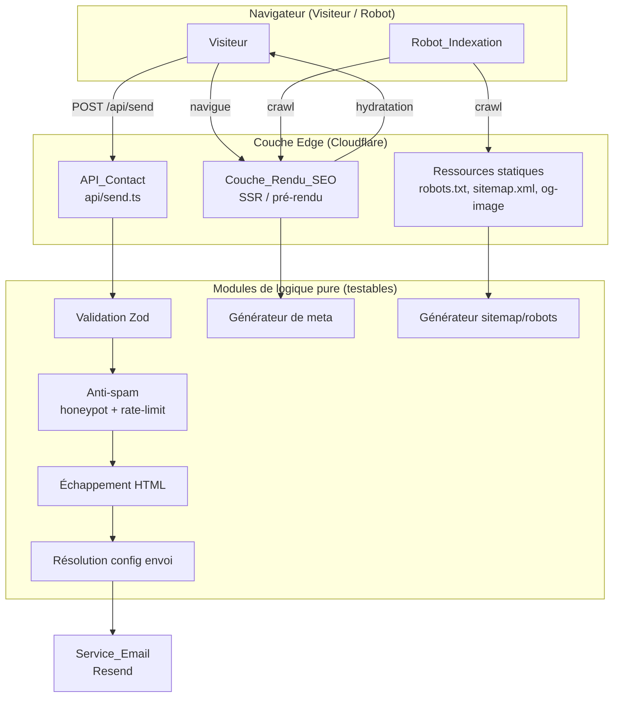
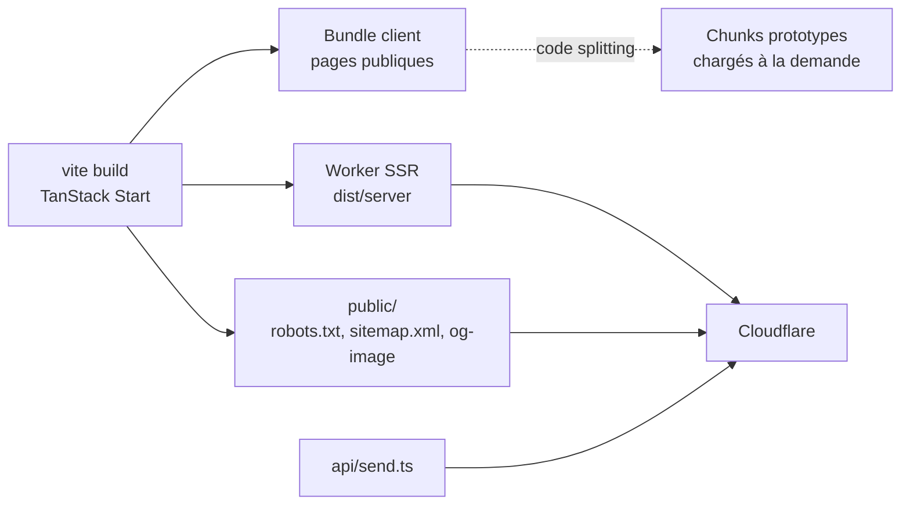

# Design Document

## Overview

Ce document décrit la conception technique de l'initiative de durcissement et d'amélioration du site marketing Opays Tech. Il traduit les 15 exigences du document de requirements en décisions d'architecture, en interfaces de composants et en propriétés de correction vérifiables.

Le parti pris d'ingénierie est conforme au positionnement d'Opays Tech, cabinet d'« ingénierie de l'efficience » : on privilégie des changements petits, lisibles et réversibles, on réutilise l'outillage déjà présent (Zod, TanStack, Vite, Cloudflare) plutôt que d'introduire de nouvelles dépendances, et chaque correctif sert d'abord la sécurité, la crédibilité et la maintenabilité.

Le périmètre se répartit en quatre familles de travail, chacune adressant un groupe d'exigences :

1. **Durcissement de l'API de contact** (Exigences 1 à 4) — validation serveur, échappement HTML, anti-spam, configuration sûre des envois.
2. **Référencement et indexation** (Exigences 5 à 7) — rendu indexable, métadonnées par page, `robots.txt` / `sitemap.xml`.
3. **Conformité et confidentialité** (Exigences 8 à 10) — pages légales, information RGPD du formulaire, mise au privé des prototypes internes.
4. **Qualité front et performance** (Exigences 11 à 15) — correction d'icône, pied de page, stabilité visuelle des images, suppression du code mort, allègement du bundle public.

### Contexte technique constaté

L'analyse du code existant établit les faits suivants, qui orientent la conception :

- Le site est une SPA TanStack Router (`src/router.tsx`, routes dans `src/routes/`), bâtie avec React 19, Tailwind 4 et Vite 7. `@tanstack/react-start` est déjà présent dans les dépendances, ce qui ouvre la voie au SSR/pré-rendu sans nouvelle dépendance majeure.
- Le déploiement cible Cloudflare (`@cloudflare/vite-plugin`, artefact `dist/server/wrangler.json`). L'API de contact `api/send.ts` est un handler edge à la signature Web standard (`(req: Request) => Response`).
- `Zod` (v3) est déjà installé : il sera le socle de la validation serveur, sans ajout de librairie.
- Les routes prototypes `tenant-0` et `bridges-os` existent et sont liées depuis la `Navbar` (lien « Tenant 0 »), donc actuellement exposées au public.
- Le `Footer` affiche une année figée (`© 2024`) et une mention en anglais ; le lien « Privacy » pointe vers `#`. Le composant `Bullet` de `Contact.tsx` est défini mais jamais utilisé. L'icône du bloc Contact rend un caractère brut (`●`) via une classe `material-symbols-outlined` dont la police n'est pas chargée.

### Objectifs de conception

| Objectif | Exigences couvertes |
|----------|---------------------|
| Aucune donnée non validée n'atteint le Service_Email | 1, 2, 3 |
| Aucun secret ni adresse en dur dans le code versionné | 4 |
| Les robots reçoivent du HTML peuplé pour toutes les pages publiques | 5, 6, 7 |
| Le site respecte les obligations FR/UE/RGPD | 8, 9 |
| Les prototypes internes ne fuient pas (navigation, indexation, bundle) | 10, 15 |
| Le front est propre, stable et crédible | 11, 12, 13, 14 |

## Architecture

### Vue d'ensemble des flux



### Décisions d'architecture et justifications

**A1. SSR/pré-rendu via TanStack Start plutôt que SPA pure (Exigence 5).**
Le contenu marketing étant statique et peu fréquemment mis à jour, le pré-rendu (génération de HTML peuplé au build, hydraté côté client) répond à l'Exigence 5 au moindre coût et préserve la navigation client après hydratation (5.3). `@tanstack/react-start` est déjà installé et compatible avec la cible Cloudflare. On évite ainsi une dépendance externe et une refonte de la SPA. Le SSR à la requête reste une option de repli si une page nécessite du contenu dynamique.

**A2. Validation serveur centralisée par schéma Zod (Exigences 1, 4).**
Toute la logique d'acceptation/rejet est concentrée dans un module pur `validateContactSubmission(rawBody)` retournant un résultat discriminé (`ok` / `error` avec code HTTP). L'API edge devient une fine couche de transport : elle lit la requête, délègue la décision au module, puis répond. Ce découpage rend la logique testable par propriétés sans dépendance réseau.

**A3. Échappement HTML dédié et systématique (Exigence 2).**
Une fonction pure `escapeHtml(value)` est appliquée à chaque valeur avant insertion dans le `Modele_Email`. Aucune valeur soumise n'est concaténée brute. Cela neutralise l'injection HTML/script tout en conservant le texte lisible (2.2).

**A4. Anti-spam à deux niveaux (Exigence 3).**
Niveau 1, le Champ_Honeypot : un champ masqué (`aria-hidden`, hors tabulation, hors flux visuel) rejeté côté serveur s'il est rempli — réponse 200 silencieuse pour ne pas renseigner le robot (3.2). Niveau 2, une limitation de débit par IP source sur fenêtre glissante (3.3, 3.4), conçue comme un module à interface stable, branché sur un magasin compatible edge (Cloudflare KV ou cache à TTL) et désactivable par configuration (`WHERE une limitation est activée`).

**A5. Configuration par variables d'environnement (Exigence 4).**
L'adresse destinataire, l'adresse expéditrice (domaine vérifié) et la clé Resend proviennent exclusivement de Variable_Environnement. Un module `resolveEmailConfig(env)` valide leur présence au démarrage de la requête et échoue proprement (500) sans divulguer de secret.

**A6. Gestion des métadonnées par route (Exigences 6).**
Les balises `<head>` sont déclarées par route via l'API `head()` de TanStack Router, alimentées par un générateur pur `buildPageMeta(pageMetaInput)` produisant titre, description, canonical, Open Graph et JSON-LD. Cela garantit une couverture homogène et testable.

**A7. Ressources d'indexation servies en statique (Exigence 7).**
`robots.txt` et `sitemap.xml` sont produits par un générateur pur à partir d'une source unique de pages publiques (`PUBLIC_ROUTES`), puis émis dans le dossier `public/` (ou via une route edge). La source unique garantit la cohérence entre navigation, sitemap et exclusions des prototypes.

**A8. Mise au privé des prototypes (Exigences 10, 15).**
Trois barrières complémentaires : retrait des liens publics de la `Navbar` (10.1), marquage `noindex` + exclusion du sitemap et du `robots.txt` (10.2, 10.3, 7.4), et chargement différé (code splitting) ou exclusion du bundle public (15.1, 15.2). Une protection de repli (filtrage de contenu / validation de session) s'applique si le contrôle principal échoue (10.6).

### Cible de déploiement



## Components and Interfaces

### 1. Module de validation de contact (`src/server/contact/validation.ts`)

Logique pure, sans I/O. Source de vérité des Exigences 1 et 2.

```typescript
// Champs attendus du Formulaire_Contact
interface ContactFields {
  company: string;
  role: string;
  process: string;
  contact: string;
  // Champ_Honeypot : doit rester vide
  website?: string;
}

type ValidationResult =
  | { ok: true; value: ContactFields }
  | { ok: false; status: 400 | 405 | 415; message: string };

// Schéma Zod : chaînes obligatoires, longueur 0..2000, e-mail optionnel si format e-mail
const contactSchema: z.ZodType<ContactFields>;

// Valide la méthode, le content-type, le JSON puis le schéma.
function validateContactRequest(input: {
  method: string;
  contentType: string | null;
  rawBody: string;
}): ValidationResult;
```

Règles encodées : méthode ≠ POST → 405 (1.1) ; `Content-Type` ≠ `application/json` → 415 (1.2) ; JSON invalide → 400 (1.3) ; champ absent ou non-chaîne → 400 (1.4, 1.5) ; longueur > 2000 → 400 (1.6) ; chaîne vide acceptée (1.7) ; `contact` au format e-mail validé si fourni comme e-mail (1.8).

### 2. Module d'échappement HTML (`src/server/contact/escape.ts`)

```typescript
// Échappe &, <, >, ", ' — sans double-échappement destructeur du texte lisible.
function escapeHtml(value: string): string;

// Construit le Modele_Email en échappant chaque valeur insérée.
function buildEmailHtml(fields: ContactFields): string;
```

### 3. Module anti-spam (`src/server/contact/antispam.ts`)

```typescript
interface RateLimitConfig {
  enabled: boolean;
  maxPerWindow: number;
  windowSeconds: number;
}

interface RateLimitStore {
  hit(ip: string, windowSeconds: number): Promise<number>; // nb de hits dans la fenêtre
}

// true si le honeypot est rempli (soumission à ignorer silencieusement).
function isHoneypotTriggered(fields: ContactFields): boolean;

// Décide d'accepter/rejeter selon la limite. Retourne 429 si dépassement.
async function checkRateLimit(
  ip: string,
  config: RateLimitConfig,
  store: RateLimitStore,
): Promise<{ allowed: boolean; status?: 429 }>;
```

### 4. Module de configuration d'envoi (`src/server/contact/config.ts`)

```typescript
interface EmailConfig {
  toAddress: string;
  fromAddress: string; // domaine vérifié auprès du Service_Email
  apiKey: string;
}

type ConfigResult =
  | { ok: true; config: EmailConfig }
  | { ok: false; status: 500; logMessage: string }; // sans secret

function resolveEmailConfig(env: Record<string, string | undefined>): ConfigResult;
```

### 5. Handler edge (`api/send.ts`)

Couche de transport mince qui orchestre les modules ci-dessus.

```typescript
export default async function handler(req: Request): Promise<Response>;
// 1. validateContactRequest → 405/415/400 le cas échéant
// 2. isHoneypotTriggered → 200 silencieux
// 3. resolveEmailConfig → 500 si config absente
// 4. checkRateLimit → 429 si dépassement
// 5. buildEmailHtml + envoi Resend → 200 même si échec aval (Exigence 1.10)
```

### 6. Générateur de métadonnées (`src/lib/seo/meta.ts`)

```typescript
interface PageMetaInput {
  path: string;        // chemin de la page
  title: string;
  description: string;
  ogImage: string;     // URL absolue
  ogType?: string;     // défaut "website"
  noindex?: boolean;   // true pour Pages_Prototype
}

interface MetaTag { tag: "title" | "meta" | "link" | "script"; attrs: Record<string, string>; children?: string; }

const SITE_ORIGIN: string; // origine canonique absolue

function buildPageMeta(input: PageMetaInput): MetaTag[]; // title, description, canonical, og:*, JSON-LD
function buildOrganizationJsonLd(): object;              // type Organization/LocalBusiness
```

### 7. Générateur robots/sitemap (`src/lib/seo/sitemap.ts`)

```typescript
interface PublicRoute { path: string; changefreq?: string; priority?: number; }

const PUBLIC_ROUTES: PublicRoute[];     // source unique des pages publiques
const PROTOTYPE_ROUTES: string[];       // /tenant-0, /bridges-os

function buildRobotsTxt(origin: string): string;   // référence le sitemap, exclut les prototypes
function buildSitemapXml(origin: string): string;  // n'inclut que PUBLIC_ROUTES
```

### 8. Composants front impactés

| Composant | Modification | Exigences |
|-----------|--------------|-----------|
| `Navbar.tsx` | Retirer le lien « Tenant 0 » (et tout lien prototype) | 10.1 |
| `Footer.tsx` | Année dynamique, mention FR, liens fonctionnels vers `/mentions-legales` et `/confidentialite` | 8.3, 8.5, 12.1, 12.2 |
| `Contact.tsx` | Icône via ressource chargée (Lucide), champ honeypot, mention RGPD + lien confidentialité + consentement, suppression de `Bullet` | 3.1, 9.1–9.4, 11.1–11.3, 14.1 |
| `__root.tsx` / routes | Déclaration `head()` par route via `buildPageMeta` | 5, 6 |
| `routes/mentions-legales.tsx` | Nouvelle Page_Mentions_Legales | 8.1 |
| `routes/confidentialite.tsx` | Nouvelle Page_Confidentialite (FR) | 8.2, 8.6 |
| `routes/tenant-0.tsx`, `routes/bridges-os.tsx` | `noindex`, code splitting, anonymisation des données fictives | 10.2, 10.4, 15.2 |

## Data Models

### Soumission de contact

```typescript
interface ContactFields {
  company: string;   // 0..2000
  role: string;      // 0..2000
  process: string;   // 0..2000
  contact: string;   // 0..2000 ; format e-mail vérifié si fourni comme e-mail
  website?: string;  // Champ_Honeypot ; non vide ⇒ soumission ignorée
}
```

### Métadonnées de page

```typescript
interface PageMetaInput {
  path: string;
  title: string;
  description: string;
  ogImage: string;   // URL absolue
  ogType?: string;
  noindex?: boolean;
}
```

### Routes publiques (source unique)

```typescript
interface PublicRoute {
  path: string;
  changefreq?: "daily" | "weekly" | "monthly";
  priority?: number; // 0.0..1.0
}
```

### Configuration d'envoi

```typescript
interface EmailConfig {
  toAddress: string;   // CONTACT_TO_EMAIL
  fromAddress: string; // CONTACT_FROM_EMAIL (domaine vérifié)
  apiKey: string;      // RESEND_API_KEY
}

interface RateLimitConfig {
  enabled: boolean;        // RATE_LIMIT_ENABLED
  maxPerWindow: number;    // RATE_LIMIT_MAX
  windowSeconds: number;   // RATE_LIMIT_WINDOW_SECONDS
}
```

## Correctness Properties

*Une propriété est une caractéristique ou un comportement qui doit rester vrai pour toutes les exécutions valides d'un système — autrement dit, un énoncé formel de ce que le système doit faire. Les propriétés font le pont entre une spécification lisible par un humain et des garanties de correction vérifiables par la machine.*

Les propriétés ci-dessous portent sur les modules de logique pure du périmètre (validation, échappement, anti-spam, configuration, génération de métadonnées et de robots/sitemap, et états de formulaire). Les exigences relevant du SSR, du packaging, du contenu ou de la configuration externe sont couvertes par des tests d'intégration, d'exemple ou de smoke (voir Testing Strategy) et n'apparaissent pas ici. Les propriétés ont été consolidées pour éliminer les redondances identifiées en prework.

### Property 1: Rejet des méthodes non-POST

*Pour toute* méthode HTTP différente de `POST`, l'API_Contact rejette la requête avec le code de statut 405.

**Validates: Requirements 1.1**

### Property 2: Rejet des Content-Type non JSON

*Pour tout* en-tête `Content-Type` différent de `application/json`, l'API_Contact rejette la requête avec le code de statut 415.

**Validates: Requirements 1.2**

### Property 3: Rejet du JSON invalide

*Pour toute* chaîne de corps qui n'est pas un JSON valide, l'API_Contact rejette la requête avec le code de statut 400.

**Validates: Requirements 1.3**

### Property 4: Champs obligatoires de type chaîne

*Pour tout* corps JSON où au moins un des champs `company`, `role`, `process`, `contact` est absent ou n'est pas une chaîne de caractères, l'API_Contact rejette la requête avec le code de statut 400 et un message d'erreur descriptif.

**Validates: Requirements 1.4, 1.5**

### Property 5: Frontière de longueur des champs

*Pour toute* valeur de champ, la validation accepte la valeur lorsque sa longueur est comprise entre 0 et 2000 caractères inclus et la rejette avec le code 400 lorsque sa longueur dépasse 2000 caractères.

**Validates: Requirements 1.6, 1.7**

### Property 6: Validation du format e-mail du champ contact

*Pour toute* valeur du champ `contact` fournie sous forme d'adresse e-mail, la validation réussit si et seulement si la valeur respecte un format d'adresse e-mail valide.

**Validates: Requirements 1.8**

### Property 7: Soumission valide acceptée indépendamment de l'aval

*Pour toute* soumission valide, l'API_Contact transmet la soumission au Service_Email et répond avec le code de statut 200, y compris en cas de défaillance en aval du Service_Email.

**Validates: Requirements 1.9, 1.10**

### Property 8: Neutralisation de l'injection HTML

*Pour toute* valeur soumise, le Modele_Email produit après échappement ne contient aucune balise HTML active issue de la valeur (les caractères `&`, `<`, `>`, `"`, `'` sont échappés avant insertion).

**Validates: Requirements 2.1, 2.3**

### Property 9: Round-trip de lisibilité après échappement

*Pour toute* chaîne soumise, le déséchappement du contenu échappé restitue exactement la chaîne d'origine (`unescape(escape(x)) == x`), garantissant la lisibilité du texte.

**Validates: Requirements 2.2**

### Property 10: Honeypot rempli ignoré silencieusement

*Pour toute* soumission dont le Champ_Honeypot est non vide, l'API_Contact répond avec le code de statut 200 sans solliciter le Service_Email.

**Validates: Requirements 3.2**

### Property 11: Limitation de débit par fenêtre

*Pour toute* séquence de soumissions provenant d'une même adresse IP source lorsque la limitation est activée, l'API_Contact accepte au plus `maxPerWindow` soumissions sur la fenêtre configurée et répond 429 à toute soumission excédentaire.

**Validates: Requirements 3.3, 3.4**

### Property 12: Échec de configuration sans fuite de secret

*Pour tout* environnement où une variable d'environnement requise pour l'envoi est absente, l'API_Contact répond avec le code de statut 500 et journalise un message ne contenant aucun secret (ni adresse destinataire, ni clé d'API).

**Validates: Requirements 4.1, 4.2**

### Property 13: Complétude des balises de tête par page

*Pour toute* entrée de métadonnées de page, le générateur produit une balise `<title>`, une balise meta `description`, et les balises Open Graph `og:title`, `og:description`, `og:type`, `og:url` et `og:image`.

**Validates: Requirements 6.1, 6.3**

### Property 14: URLs canonique et og:image absolues

*Pour tout* chemin de page, le générateur produit une balise `<link rel="canonical">` et une balise `og:image` dont les valeurs sont des URLs absolues cohérentes avec l'origine canonique du site.

**Validates: Requirements 6.2, 6.5**

### Property 15: JSON-LD Organization valide

*Pour toute* page publique, le bloc de données structurées émis est un JSON-LD analysable décrivant Opays Tech avec un type `Organization` ou `LocalBusiness`.

**Validates: Requirements 6.4**

### Property 16: Référence absolue du sitemap dans robots.txt

*Pour toute* origine, la sortie de `buildRobotsTxt` contient l'URL absolue du Sitemap_Xml.

**Validates: Requirements 7.2**

### Property 17: Couverture exacte du sitemap

*Pour toute* origine, le Sitemap_Xml généré liste en URL absolues toutes les routes publiques, et seulement elles.

**Validates: Requirements 7.3**

### Property 18: Exclusion des prototypes de l'indexation

*Pour toute* origine, chaque route prototype est en `Disallow` dans le Robots_Txt et absente du Sitemap_Xml.

**Validates: Requirements 7.4, 10.3**

### Property 19: Marquage noindex des prototypes

*Pour toute* route prototype, le générateur de métadonnées produit une directive `noindex`.

**Validates: Requirements 10.2**

### Property 20: Navbar sans lien vers les prototypes

*Pour tout* rendu de la Navbar, aucun lien affiché ne cible une route prototype.

**Validates: Requirements 10.1**

### Property 21: Équivalence soumission / consentement

*Pour tout* état du Formulaire_Contact où un consentement explicite est requis, la soumission est autorisée si et seulement si le consentement a été donné ; en l'absence de consentement, la soumission est empêchée et un message d'information est affiché.

**Validates: Requirements 9.3, 9.4**

### Property 22: Année de copyright courante

*Pour toute* date courante fournie, le Footer affiche une année de copyright égale à l'année de cette date.

**Validates: Requirements 12.1**

### Property 23: Dimensions explicites des images publiques

*Pour toute* image affichée dans une page publique, les attributs `width` et `height` sont définis, réservant l'espace d'affichage avant chargement complet.

**Validates: Requirements 13.1, 13.2**

## Error Handling

La stratégie de gestion des erreurs vise des réponses déterministes, sûres (sans fuite de secret) et conformes aux codes de statut attendus.

### API_Contact

| Condition | Réponse | Journalisation |
|-----------|---------|----------------|
| Méthode ≠ POST | 405 | Aucune (bruit attendu) |
| `Content-Type` ≠ `application/json` | 415 | Aucune |
| JSON invalide | 400 + message | Niveau debug |
| Champ manquant / mauvais type | 400 + message descriptif | Niveau debug |
| Longueur > 2000 | 400 + message | Niveau debug |
| Honeypot rempli | 200 (silencieux) | Niveau info (compteur spam) |
| Dépassement de débit | 429 | Niveau info (IP tronquée) |
| Variable d'environnement manquante | 500 + message **sans secret** | Niveau error (config) |
| Défaillance du Service_Email après validation | 200 | Niveau error (alerte délivrabilité) |
| Exception inattendue | 500 générique | Niveau error |

Principes :

- **Pas de fuite de secret.** Les messages d'erreur et les logs ne contiennent jamais l'adresse destinataire ni la clé d'API (Exigence 4.2). Les adresses IP journalisées sont tronquées.
- **Réponses silencieuses pour l'anti-spam.** Honeypot déclenché ⇒ 200 sans indication, pour ne pas renseigner les robots (Exigence 3.2).
- **Découplage de l'aval.** Une soumission valide reçoit 200 même si Resend échoue (Exigence 1.10) ; l'échec est journalisé pour suivi de délivrabilité, mais n'affecte pas l'expérience du Visiteur.
- **Messages utilisateur en français**, neutres et non techniques, côté formulaire (`Contact.tsx`).

### Front et navigation

- **Liens légaux rompus** : le Footer reste rendu avec les liens en l'état (Exigence 8.4) ; aucune erreur fatale ne masque le pied de page.
- **Garde des prototypes** : un accès non autorisé est refusé ou redirigé vers une page publique (Exigence 10.5) ; en cas d'échec du contrôle principal, une protection complémentaire (filtrage de contenu / validation de session) s'applique avant tout affichage (Exigence 10.6).
- **Icône de contact** : rendu via une ressource SVG Lucide effectivement chargée, sans dépendance à une police externe non chargée, ce qui élimine le glyphe brut de repli (Exigences 11.1–11.3).

## Testing Strategy

### Approche duale

La couverture combine **tests unitaires / d'exemple** (comportements concrets, cas limites, interactions UI), **tests de propriété** (propriétés universelles sur la logique pure) et **tests d'intégration / smoke** (SSR, packaging, configuration externe). Ces familles sont complémentaires : les tests de propriété valident la correction générale, les tests d'exemple ancrent les comportements concrets, les tests d'intégration vérifient le câblage réel.

### Outillage

- **Exécuteur de tests** : Vitest (cohérent avec l'écosystème Vite déjà en place).
- **Tests de propriété** : `fast-check`, librairie standard de PBT pour TypeScript. La PBT n'est **pas** réimplémentée à la main.
- **Tests de composants** : Testing Library (React) pour les rendus de `Navbar`, `Footer`, `Contact`.
- **Tests e2e / intégration** : un harnais de requêtes HTTP brutes pour le SSR et un build de vérification pour le packaging.

### Configuration des tests de propriété

- Minimum **100 itérations** par test de propriété (`fast-check` : `numRuns: 100`).
- Chaque test de propriété référence sa propriété de conception via un commentaire au format :
  **Feature: site-hardening-amelioration, Property {numéro}: {texte de la propriété}**
- Chaque propriété de la section Correctness Properties est implémentée par **un seul** test de propriété.

### Cartographie des propriétés vers les tests

| Propriété | Module testé | Générateurs clés |
|-----------|--------------|------------------|
| 1, 2, 3 | `validateContactRequest` | méthodes HTTP, content-types, chaînes non-JSON |
| 4, 5, 6 | `validateContactRequest` / schéma Zod | objets partiels, longueurs 0..N, e-mails valides/invalides |
| 7 | handler + mock Resend | soumissions valides, mock succès/échec |
| 8, 9 | `escapeHtml` / `buildEmailHtml` | chaînes arbitraires, charges utiles `<script>` |
| 10 | `isHoneypotTriggered` + handler | soumissions avec honeypot non vide |
| 11 | `checkRateLimit` + store en mémoire | séquences de hits par IP |
| 12 | `resolveEmailConfig` | environnements amputés d'une variable |
| 13, 14, 15 | `buildPageMeta` / `buildOrganizationJsonLd` | `PageMetaInput` aléatoires, paths |
| 16, 17, 18 | `buildRobotsTxt` / `buildSitemapXml` | origines aléatoires |
| 19 | `buildPageMeta` (routes prototypes) | routes prototypes |
| 20 | rendu `Navbar` | — (rendu déterministe vérifié contre PROTOTYPE_ROUTES) |
| 21 | logique de consentement du formulaire | états de consentement |
| 22 | logique d'année du `Footer` | dates arbitraires |
| 23 | rendu des pages publiques | inventaire d'images |

### Tests d'exemple et de cas limites (non-PBT)

- **Honeypot masqué** (3.1) : rendu de `Contact`, vérification de l'attribut masquant et `tabIndex=-1`.
- **Pages légales** (8.1, 8.2, 8.3, 8.5) : routes `/mentions-legales` et `/confidentialite` rendues ; liens du Footer fonctionnels.
- **Lien légal rompu** (8.4) : le Footer reste affiché.
- **Information RGPD** (9.1, 9.2) : mention de finalité et lien confidentialité présents près du bouton.
- **Icône de contact** (11.1, 11.3) : SVG Lucide présent, glyphe brut absent.
- **Mention FR du Footer** (12.2).

### Tests d'intégration et smoke (non-PBT)

- **SSR / rendu indexable** (5.1, 5.2, 5.3) : requêtes HTML brutes par page publique, vérification du contenu principal et du `<head>` ; test e2e de navigation après hydratation.
- **Service statique** (7.1) : `GET /robots.txt` et `GET /sitemap.xml` renvoient 200.
- **Garde des prototypes** (10.5, 10.6) : accès non autorisé refusé / redirigé ; repli appliqué en cas d'échec du contrôle principal.
- **Domaine expéditeur vérifié** (4.3) et **absence de secret dans le source** (4.4) : smoke + scan statique.
- **Anonymisation des prototypes** (10.4) et **suppression du code mort** (14.1) : revue / scan du source.
- **Build et lint** (14.2) : `npm run build` et `npm run lint` sans erreur.
- **Packaging** (15.1, 15.2, 15.3) : analyse du bundle (prototypes en chunks séparés, hors bundle initial) et vérification du format/résolution des images.

### Justification du périmètre PBT

La PBT est appliquée aux modules à logique pure et à fort espace d'entrée (validation, échappement, anti-spam, configuration, génération de métadonnées et de robots/sitemap, états de formulaire), où « pour toute entrée, propriété P » a un sens et où 100+ itérations révèlent des cas limites (caractères spéciaux, frontières de longueur, e-mails dégénérés, origines variées). Elle n'est **pas** appliquée au SSR, au packaging du bundle, au pipeline d'images, ni à la configuration externe (vérification de domaine Resend), dont le comportement ne varie pas significativement avec l'entrée et relève de tests d'intégration ou de smoke.
