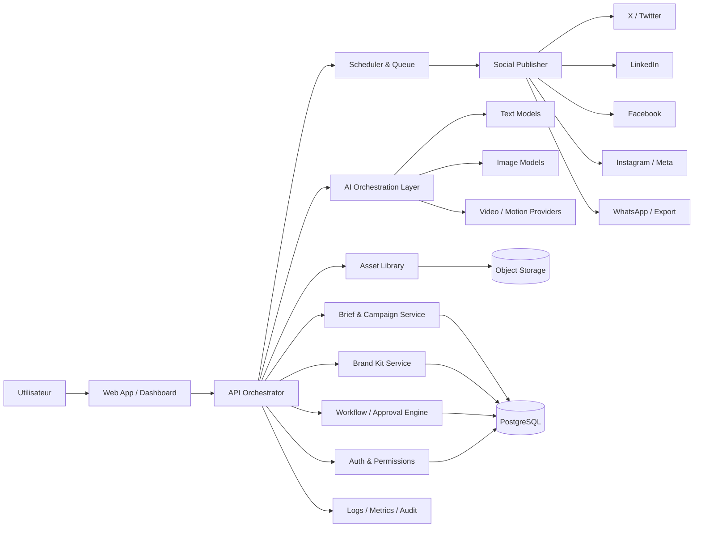

# Architecture technique — Brand Content OS

## 1. Principe directeur
Architecture **modulaire, gouvernée, extensible**.

Objectif :
- produire du contenu,
- l’adapter à chaque réseau,
- publier de manière fiable,
- garder une base réutilisable,
- pouvoir évoluer vers du cloud, du privé ou du self-hosted.

## 2. Vue d’ensemble

## 3. Couche front
### Recommandation
- Next.js ou équivalent React moderne
- interface orientée travail
- composants réutilisables
- parcours très court :
  1. brief
  2. génération
  3. validation
  4. publication

### Écrans clés
- dashboard
- brand kit
- composer
- bibliothèque
- calendrier
- file de validation
- publication
- analytics
- administration

## 4. Couche backend
### Services principaux
#### 4.1 API Orchestrator
Point d’entrée unique :
- reçoit le brief,
- appelle les services IA,
- enregistre les versions,
- prépare la publication,
- pilote le workflow.

#### 4.2 Brand Kit Service
Stocke :
- identité visuelle,
- ton,
- règles éditoriales,
- templates,
- variantes autorisées.

#### 4.3 Content Service
Gère :
- campagnes,
- posts,
- variantes,
- métadonnées,
- langue,
- canal,
- statut.

#### 4.4 Workflow Engine
Gère :
- brouillon,
- revue,
- approbation,
- rejet,
- programmation,
- publication.

#### 4.5 Publisher Service
Gère :
- les tokens sociaux,
- les files d’attente,
- les limites API,
- les retries,
- les erreurs,
- les confirmations.

## 5. Couche IA
### Text
Utilisation d’un LLM pour :
- écrire,
- reformuler,
- condenser,
- adapter à chaque réseau,
- ajuster le ton.

### Image
Utilisation d’un générateur d’images pour :
- visuels de campagne,
- bannières,
- déclinaisons,
- illustrations de sensibilisation.

### Video / Motion
À intégrer en phase 2 ou 3 :
- animation courte,
- adaptation de format,
- sous-titres,
- export plateforme.

### Garde-fous
- règles de marque,
- filtres de conformité,
- validation humaine configurable,
- journal des prompts et sorties.

## 6. Données et stockage
### Base relationnelle
PostgreSQL recommandé pour :
- comptes,
- organisations,
- projets,
- campagnes,
- posts,
- validations,
- publications,
- logs métier.

### Object storage
Pour :
- images,
- vidéos,
- versions exportées,
- previews,
- templates médias.

### Queue / jobs
Pour :
- génération asynchrone,
- publication différée,
- retries,
- traitement des médias lourds.

## 7. Intégrations réseaux sociaux
### Réseaux à prioriser
Selon les clients ciblés :
- LinkedIn
- Facebook
- Instagram
- X / Twitter
- éventuellement WhatsApp via export ou passerelle

### Principe
Ne pas dépendre d’une seule plateforme.  
Chaque intégration doit être isolée dans un connecteur.

## 8. Sécurité et gouvernance
- auth par organisation
- rôles : admin, éditeur, valideur, lecteur
- secrets chiffrés
- audit log
- gestion des permissions par projet
- traçabilité des publications
- politique de rétention des contenus

## 9. Hébergement
### Option SaaS
- app web hébergée
- services managés
- stockage cloud
- publication centralisée

### Option privée / ONG sensible
- déploiement privé
- base dédiée
- stockage isolé
- connecteurs activés selon besoin

### Option hybride
- contenu préparé localement,
- sync dès que la connexion est disponible,
- publication centralisée quand l’accès Internet revient.

## 10. Faisabilité technique
### Très faisable
- composition de textes
- déclinaisons par canal
- calendrier éditorial
- bibliothèque de contenus
- workflow de validation

### Faisable avec intégration sérieuse
- publication directe multi-réseaux
- versioning des contenus
- analytics de base
- multi-utilisateur

### Plus complexe
- vidéo générative de qualité homogène
- orchestration multi-API à grande échelle
- offline complet avec sync bidirectionnelle riche

## 11. Recommandation d’exécution
### Premier socle
1. brief
2. brand kit
3. génération texte
4. génération image
5. validation
6. programmation
7. publication

### Ensuite
8. analytics
9. vidéo
10. automatisations avancées
11. déploiement privé / hybride

## 12. Risques
- dépendance aux APIs sociales
- évolutions de politiques externes
- coût des modèles IA
- dette de complexité si on ajoute trop de fonctions
- risque de produit trop généraliste

## 13. Choix stratégique recommandé
Le produit doit rester :

- simple à adopter,
- strict sur la marque,
- solide sur la publication,
- modulaire dans l’évolution,
- crédible pour des organisations terrain.

